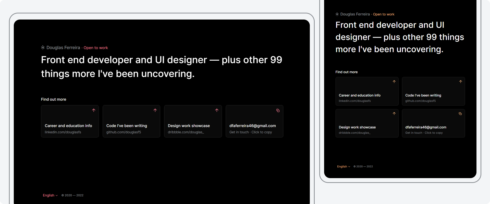
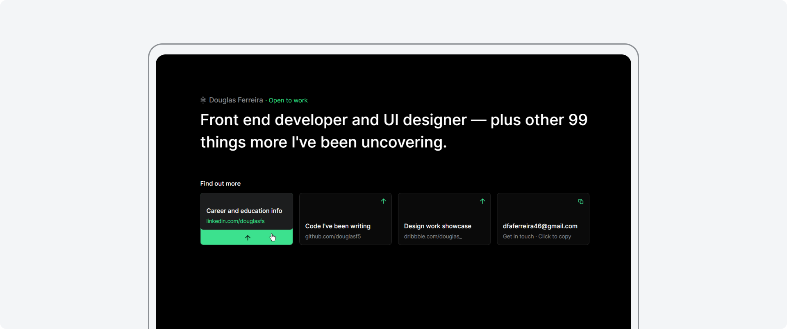
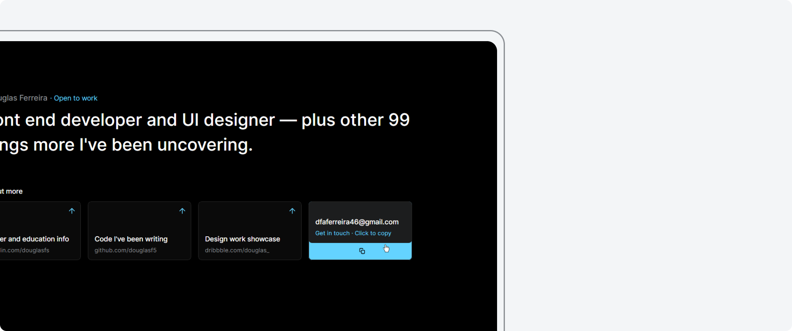
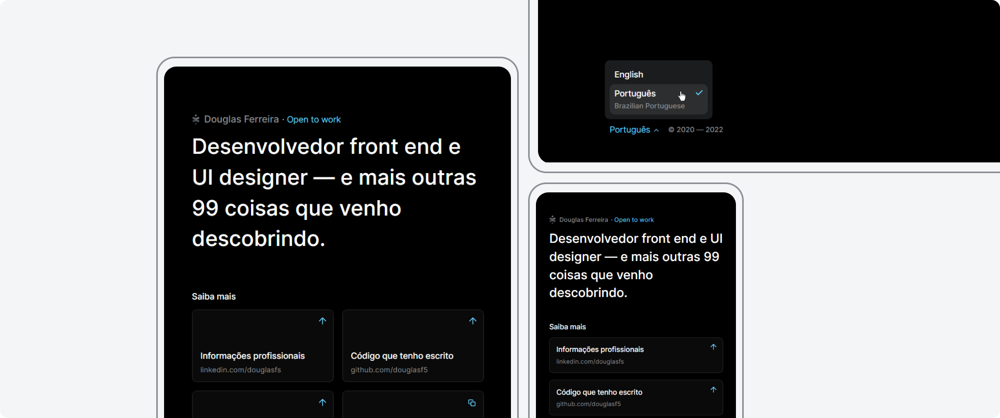

# Professional reference links page

In this project, aside from HTML, CSS and JavaScript, I used SASS for the first time to generate the final CSS used for styling a simple page that holds professional links and contact information. 

## Implemented features:

### **Responsive layout**

From desktop to mobile screens, a well-thought-out use of space.

 

### **UI micro interactions**

When interacting with the card components you see a gorgeous look come out of their simplicity through smooth and nice little animations.

 

### **Copy to clipboard**

From the same creators of "Plug and play", this is "Click and copy" (if your browser supports it, of course).

 

### **Multilanguage**

Switch between English and Brazilian Portuguese.

 

### **Pseudo-random accent color**

Just for fun, every time the page is reloaded, a new accent color (one out of 6 - it's not a lot, I know) can come into play.

 
