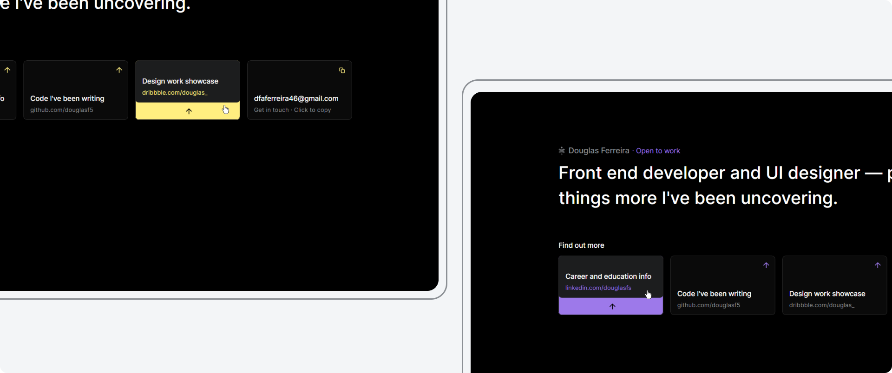

# Professional reference links page

In this project, aside from **HTML** and **JavaScript**, I used **SASS** for the first time to generate the final **CSS** and style a simple page that holds professional links and contact information. [Interact with the live project here](https://douglasf5.github.io/professional-reference-links-page/).

## Implemented features:

### **Responsive layout**

From desktop to mobile screens, a well-thought-out use of space.

 

### **UI micro interactions**

When interacting with the card components you see a gorgeous look come out of their simplicity through smooth and nice little animations.

 

### **Copy to clipboard**

From the same creators of "Plug and play", this is "Click and copy" (if your browser supports it, of course).

 

### **Multilanguage**

Switch between English and Brazilian Portuguese.

 

### **Pseudo-random accent color**

Just for fun, every time the page is reloaded, a new accent color (one out of 6 - it's not a lot, I know) can come into play.

 

## Extra notes

- This project is purely a practical exercise intended for developing and/or showcasing my skills in the tools/techniques/concepts mentioned above. It's not meant to be a complete production-ready solution. Feel free to reach out if you have any questions or simply want to chat about it!
